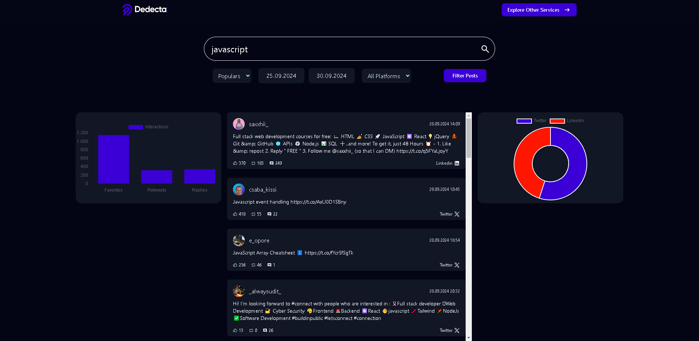
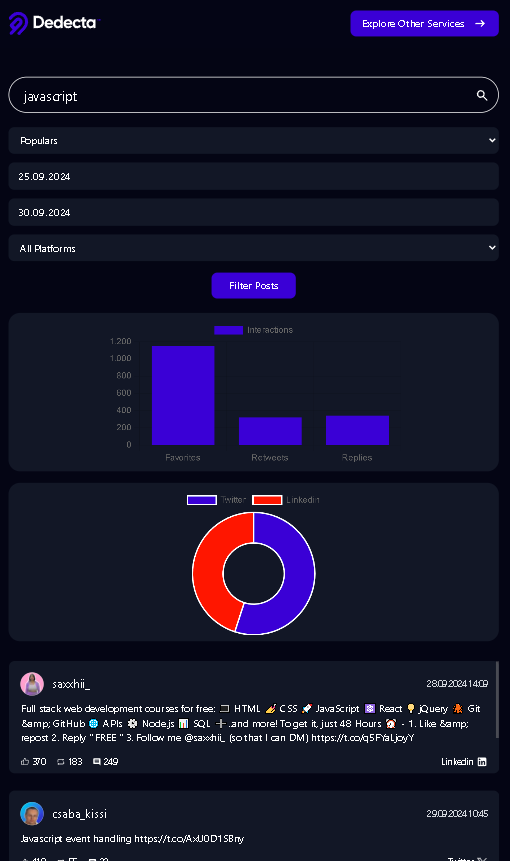

# Social-Media-Dashboard

## Live Demo

You can access the live version of the application hosted on AWS here:  
[Live Application](https://main.doiw3lef4t4wo.amplifyapp.com/)

## Overview

This Social Media Dashboard Application allows users to search for social media posts based on specific **hashtags** or **keywords**. Users can filter the results by **date range**, **platform** and sort the posts by **creation time** or **popularity**. In addition to the list view, the application provides further insights with bar and doughnut charts for data visualization.

### Key Features

- **Search Posts**: Users can search for social media posts based on filters like **hashtags**, **keywords**, **date range** and **platform**.
- **Filter and Sort Posts**: Users can filter posts by **date range**, **platform** and sort by **creation time** or **popularity**.
- **Post Details**: View important post details such as:
  - Author
  - Creation Time
  - Post Text
  - Like, Retweet and Reply Counts
  - Platform

## Tech Stack

- **Frontend**:
  - [Vue](https://vuejs.org/) with [Nuxt](https://nuxt.com/) for the user interface
  - [Tailwind CSS](https://tailwindcss.com/) for styling
- **API Integration**:
  - Rapid API The Old Bird API
- **Deployment**:
  - [AWS](https://aws.amazon.com/) for cloud hosting

## Screenshots

Here are a few screenshots of the working application:




## Installation

```bash
git clone https://github.com/bberkaykarademir/social-media-dashboard.git
cd social-media-dashboard
npm install
```

To run this application, you will need to create a `.env` file in the root of the project and add the following environment variables:

```bash
RAPIDAPI_KEY=413b110074msh099af4a3a9467a8p1df552jsn42bcb46b459d
RAPIDAPI_HOST=twitter154.p.rapidapi.com
```

```bash
npm run dev
```

Open [http://localhost:3000](http://localhost:3000) with your browser to see the result.

## Tech Notes

- The Old Bird API did not provide sufficient data for the UI's filters and posts so I added platform data, platform filtering and sorting on the frontend.
